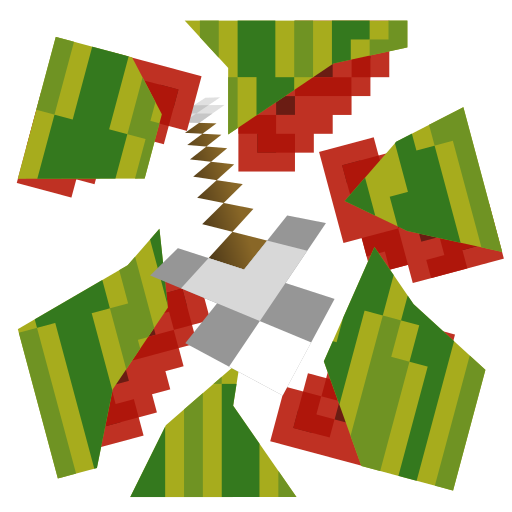
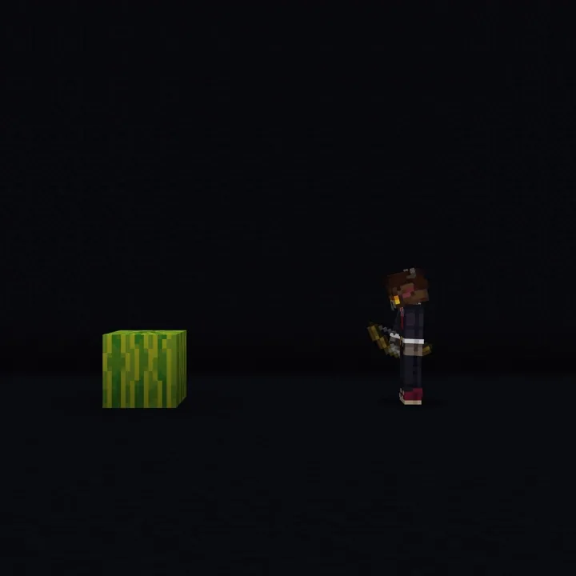

# <!-- $localAssetToURL --> Smashing<!--$headerTitle--><!--$pmc:delete-->
Arrows and Tridents can break more blocks! <!--$pmc:headerSize-->

 <!--$localAssetToURL--> <!--$modrinth:replaceWithVideo--> <!--$pmc:delete-->

In vanilla, Arrows and Tridents can break decorated pots and chorus flowers, and Tridents can break pointed dripstone.

This adds the following blocks:
### Arrow Breakable
<table>
  <tbody>
    <tr>
      <td>Candles</td>
      <td>Cakes</td>
      <td>Cactus</td>
    </tr>
    <tr>
      <td>Flower Pots</td>
      <td>Glass Panes</td>
      <td>Sea Pickle</td>
    </tr>
    <tr>
      <td>Big Dripleaf</td>
      <td>Lily Pad</td>
      <td>Melon</td>
    </tr>
    <tr>
      <td>Pumpkin</td>
      <td>Carved Pumpkin</td>
      <td>Jack o'Lantern</td>
    </tr>
  </tbody>
</table>

### Trident Breakable
Everything an arrow can break and...
<table>
  <tbody>
    <tr>
      <td>Bamboo</td>
      <td>Cocoa Beans</td>
    </tr>
    <tr>
      <td>Dried Ghast</td>
      <td>Amethyst Clusters & Buds</td>
    </tr>
  </tbody>
</table>

## Known Issues
Arrows fired from dispensers need 2 blocks of space before they can break an added smashable block.

Realms servers are not supported.
